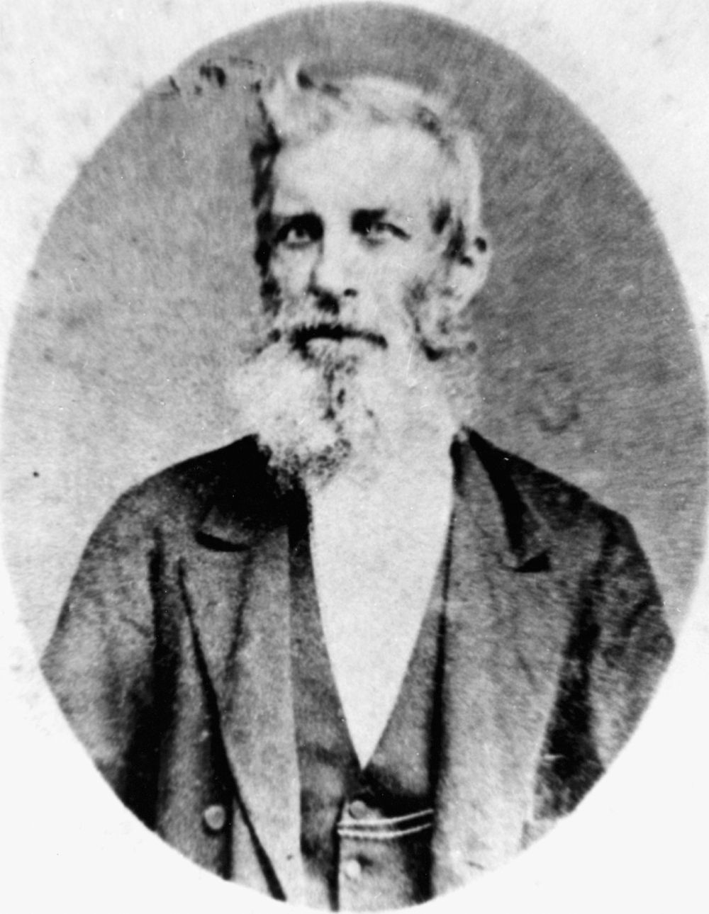

## Thomas Dowse <small>(13‑58‑22)</small>

In September 1824 15-year-old Thomas was tried for theft at the Old Bailey and sentenced to death, later commuted to transportation for life. Initially incarcerated on the prison hulks *Bellerophon* and *Euryalus*, he embarked on the convict ship *Florentia* bringing him to Port Jackson arriving in January 1828. He served eight years before receiving a ticket of leave in 1836 and a conditional pardon in 1839. 

He came to Moreton Bay in 1842 when it was opened to free settlers and was the anonymous Brisbane correspondent to the *Sydney Morning Herald*. He was a prolific writer with columns in the *Moreton Bay Courier*, *Brisbane Courier* and *The Queenslander* written under the pseudonym '[Old Tom](https://trove.nla.gov.au/search/category/newspapers?keyword=%22Old%20Tom%22%20%22OLD%20TIMES.%20THE%20SETTLEMENT%22&l-state=Queensland&l-title=42&l-decade=186&l-year=1869&sortBy=dateAsc&startPos=0)'.

{ width="40%" }

*<small>[Thomas Dowse](http://onesearch.slq.qld.gov.au/permalink/f/1upgmng/slq_alma21218687340002061) Brisbane Town Clerk 1862-1868 — State Library of Queensland.</small>*
