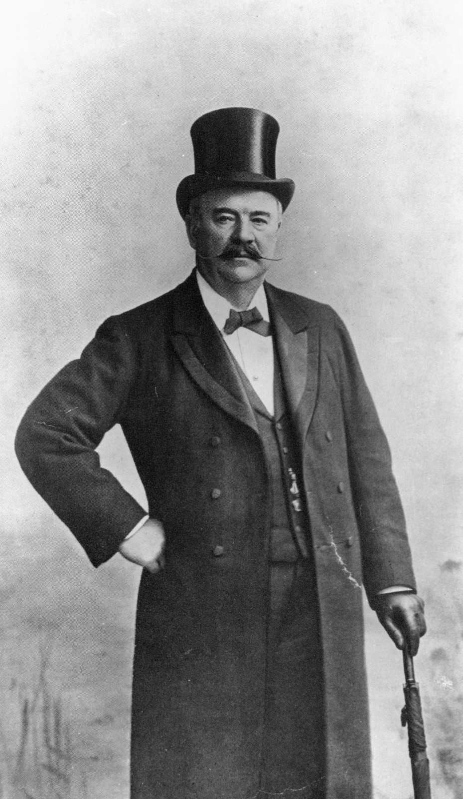

## Thomas Finney <small>[(13‑81‑6)](https://brisbane.discovereverafter.com/profile/31851115 "Go to Memorial Information" )</small>

[Thomas Finney](https://adb.anu.edu.au/biography/finney-thomas-3518) and his family lived in *Sidney House* (on the site of the former ABC Studios in Toowong) from 1882, one of the grandest houses in Toowong, surrounded by gardens and an orchard. He is buried next to his business partner James Isles with whom he [established Finney Isles & Co.](https://trove.nla.gov.au/newspaper/article/182631732) in 1864.

{ width="23.8%" }
{ width="65%" }

*<small>[Thomas Finney](http://onesearch.slq.qld.gov.au/permalink/f/1upgmng/slq_digitool127391) — State Library of Queensland </small>*  
*<small>[Sidney House in Toowong, viewed from the street, March, 1890](https://onesearch.slq.qld.gov.au/permalink/61SLQ_INST/tqqf2h/alma99183506981502061) — State Library of Queensland </small>*

<!--
Sidney House, Toowong
Journal of the Royal Historical Society of Queensland volume 5 issue 2: pp. 942-946
Slaughter, Leslie E. (Leslie Edgar). Brisbane, Qld. Royal Historical Society of Queensland, 1954

assets/sidney-house-toowong.pdf

https://en.wikipedia.org/wiki/Thomas_Finney_(politician)#/media/File:StateLibQld_1_103590_Thomas_Finney_of_Finney,_Isles_and_Co.jpg
-->
