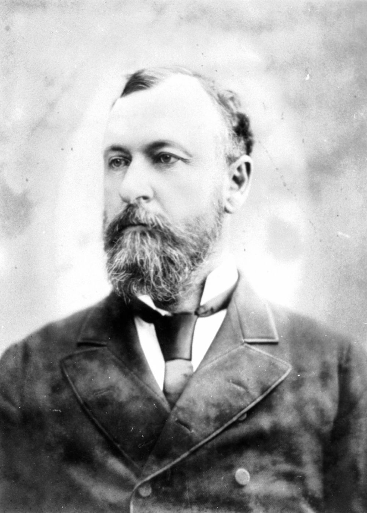

## Thomas Macdonald‑Paterson MLC <small>(12‑53-10)</small> 

{ width="40%" } 

*<small>[Politician Thomas MacDonald Paterson, 1885](http://onesearch.slq.qld.gov.au/permalink/f/1upgmng/slq_alma21218125040002061) - State Library of Queensland</small>*

Macdonald‑Paterson arrived in Rockhampton from Scotland in 1861. He worked at a butchery before moving to Brisbane, where he qualified as a solicitor. He was a member for the Queensland Central Separation League and National Association. Macdonald‑Paterson served as mayor of Rockhampton in 1870. He was a member of the Legislative Assembly from 1878 to 1885 and again from 1896 to 1901. He was a member of the Legislative Council from 1885 to 1896. He served in three tiers of government as he was the Brisbane Federal Member of the House of Representatives from 1901 to 1903. His main claims at the convention were for uniform financial legislation and the abolition of the right to appeal to the Judicial Committee of the Privy Council.
