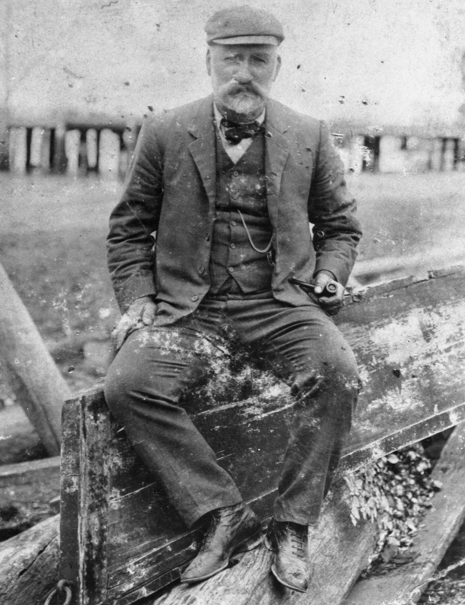

## Thomas Welsby <small>(13‑9‑1)</small>

<!-- From graveside information sign -->

Born in Ipswich in 1858 and educated at Ipswich Grammer School, Welsby joined the Bank of New South Wales in Brisbane in October 1874. Resigning as a ledger keeper in May 1879, he joined the Australian Joint Stock Bank in Brisbane. In July 1884 he left to practice as a public accountant, trustee and auditor; he became a member of the Brisbane Municipal Council accounts until 1893.

A member of Booroodabin Divisional Board in 1893-1902 (chairman 1897-1900); Welsby was chairman of the New Farm State School committee and honorary treasurer of the Brisbane Chamber of Commerce. Instrumental in the formation of the Engineering Supply Co. of Australia in 1903, he was a director of the Royal Bank of Queensland. As chairman of directors of Queensland Brewery Ltd, Welsby stamped his commercial importance and made him one of Brisbane's elite.

Welsby was elected to the Legislative Assembly in 1909 where he served until 1915. A 'club man' tall, well-built and amiable, Welsby loved history and sport. Foundation honorary tresurer (1913), president (1936-37) and vice-president (1917-36, 1937-41) of the [Historical Society of Queensland](https://queenslandhistory.org), he advocated that the government subsidise the society to collect Queensland's early records. He [bequeathed his large library to the society](https://queenslandhistory.org/welsby-library/).

Welsby died aged 83 on 3^rd^ February 1941 at his now heritage-listed New Farm home, *[Amity](https://apps.des.qld.gov.au/heritage-register/detail/?id=600264)*.

<figure markdown>
  { width="40%" }
  <figcaption markdown>[Thomas Welsby](https://onesearch.slq.qld.gov.au/permalink/61SLQ_INST/tqqf2h/alma99183512738602061) - State Library of Queensland</figcaption>
</figure>