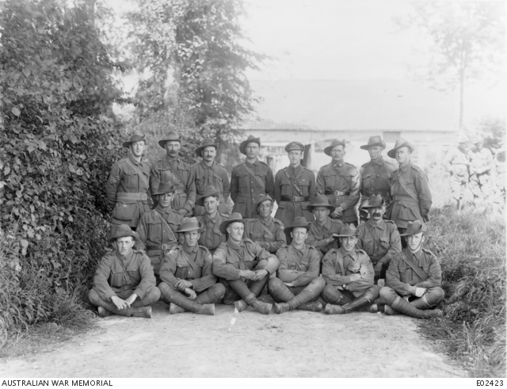

## Thomas Welsh <small>[(10‑68‑26)](https://brisbane.discovereverafter.com/profile/31847386 "Go to Memorial Information" )</small>

Ensiled in Feb 1915 aged 38 and served in the 22^nd^ Battalion. He was gassed in 1918 then went back into battle in France. Went home in late 1918 also suffering from rheumatism. 

Welsh died aged 57 in 1933 from tuberculosis. Many soldiers caught tuberculosis at a young age and recovered before they served but were then gassed in the war which weakened their lungs and allowed the tuberculosis to reinfect them and they could not recover after that. ==Lung issues were the second leading cause of death in the first 100 soldiers I researched, close behind heart issues 
(refer to end of document for more info)==.

Many Australia soldiers died an early death after WW1 due to their war service. Some soldiers were denied war pensions as their afflictions were deemed to be not from their war service but some soldiers died from those afflictions and have recently been allocated official war graves as their death is now deemed to be from their war service. For the returned Australian soldiers, more than 3,000 later died of tuberculosis and so many – with lungs irreversibly damaged by gas attacks – suffered severely from various respiratory infections that included not only tuberculosis but bronchitis, influenza, pneumonia etc

{ width="70%" class="full-width" } 

*<small>[Group portrait of nineteen members of the 22nd Battalion, who, when photographed, had not, at any time since its inception, been off the strength of their Battalion.](https://www.awm.gov.au/collection/C393735).*

*Back row, left to right: 818 Sergeant (Sgt) W. A. Freeman; 247 Lance Corporal (L/Cpl) T. Willis; **32 T. Welsh**; 359 L/Cpl E. H. Davies; Lieutenant J. Kohn MC; 54 L. S. Benson; 460 S. Sharpe; 327 John Ash.*

*Middle row: 283 Corporal (Cpl) Robert Branton Wigger; 267 Cpl F. Vaughan; 161 J. Graham; 645 Bateman Missen; 659 R. Newman.*

*Front row: 205 Keith McRae; 19 Thomas Renehan; 979 J. Caffrey; 77 Company Quartermaster Sergeant James Cugley MSM; 832 Regimental Quartermaster Sergeant Reginald B. Hawkins MSM; 461 Sgt E. C. Smart.</small>*

