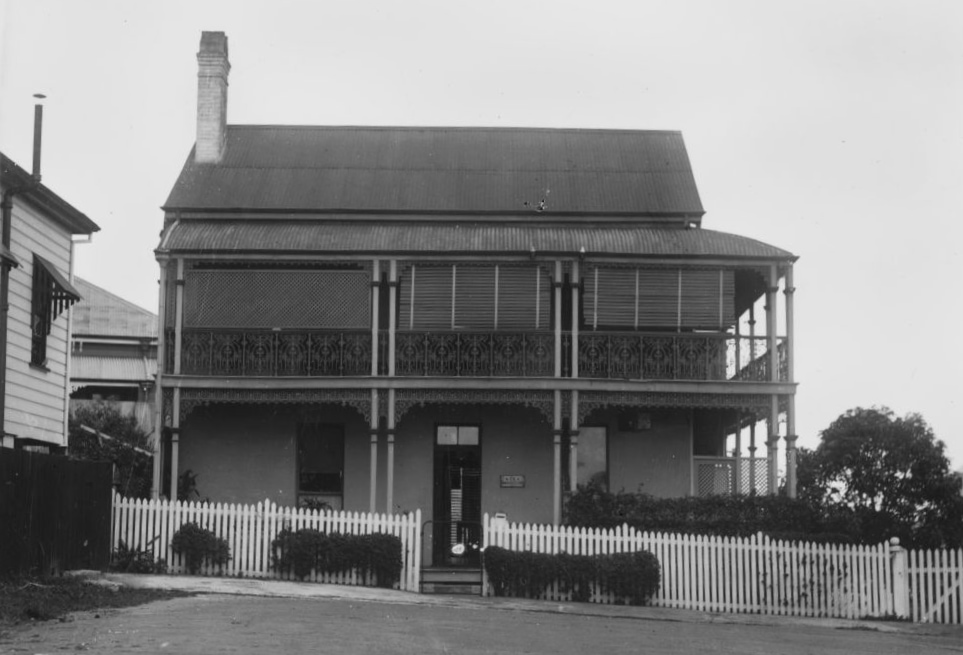

## Vera Evelyn James <small>(2A‑23‑16)</small>

As Sister Pfingst, Vera James was a trained nurse and ward sister at the Brisbane General Hospital having graduated in 1951. She was the last President of the Nurses Rest Home and Benevolent Fund. This incorporated organisation ceased to exist in 1993. The Nurses’ Rest Home, located at 17 Mallon Street, Bowen Hills, was administered by this organisation. It closed in 1992 following the sale of the building. The Nurses’ Rest Home was used as a residence for nurses for over sixty years. Vera died in 1999 aged 70.

{ width="70%" }  

*<small>[Australian Trained Nurses Association (ATNA) Women's Rest Home, Brisbane](http://onesearch.slq.qld.gov.au/permalink/f/1upgmng/slq_alma21218456390002061) — State Library of Queensland. Cropped, Rotated.</small>*
