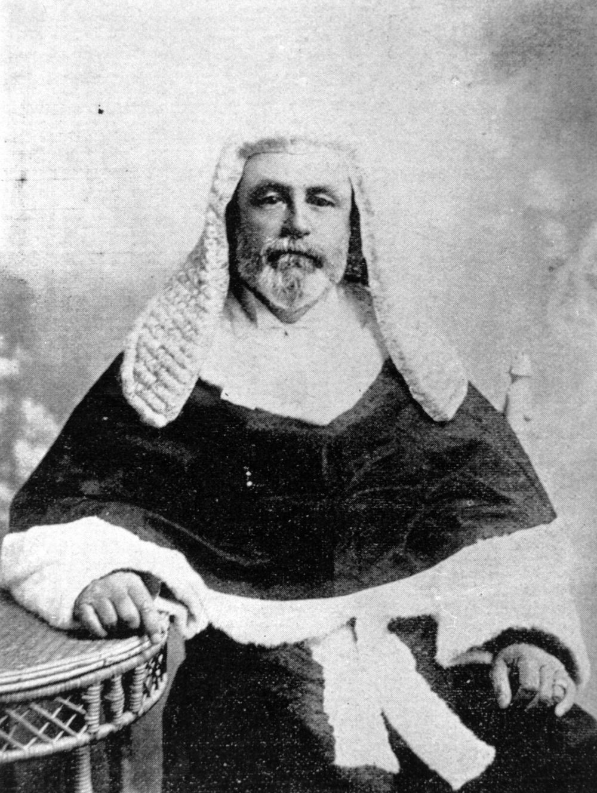

## The Honourable Virgil Power <small>(7A‑103‑24)</small>

Virgil Power (1849-1914) was born in Brisbane, the son of Michael Power, auctioneer and commission agent, and his wife Anna Marie (née Connolly).  Educated in Sydney and Ireland, he graduated with a Bachelor of Arts with honours from Trinity College, Dublin in 1871. He was admitted as a barrister of the Middle Temple, London and the King's Inn, Dublin in 1873 before returning to Queensland where he was admitted as a barrister of the Supreme Court of Queensland on 26 April 1875. He commenced a period of 20 years in practice at the private bar, holding a succession of appointments as Crown Prosecutor.  In 1895 he was the first Queensland-born judge to be appointed to the Supreme Court of Queensland as well as the first judge to be appointed to the position of Central judge, based at Rockhampton.

{ width="40%" }

*<small>[Justice Virgil Power](http://onesearch.slq.qld.gov.au/permalink/f/1upgmng/slq_alma21220314310002061) -  State Library of Queensland</small>*
