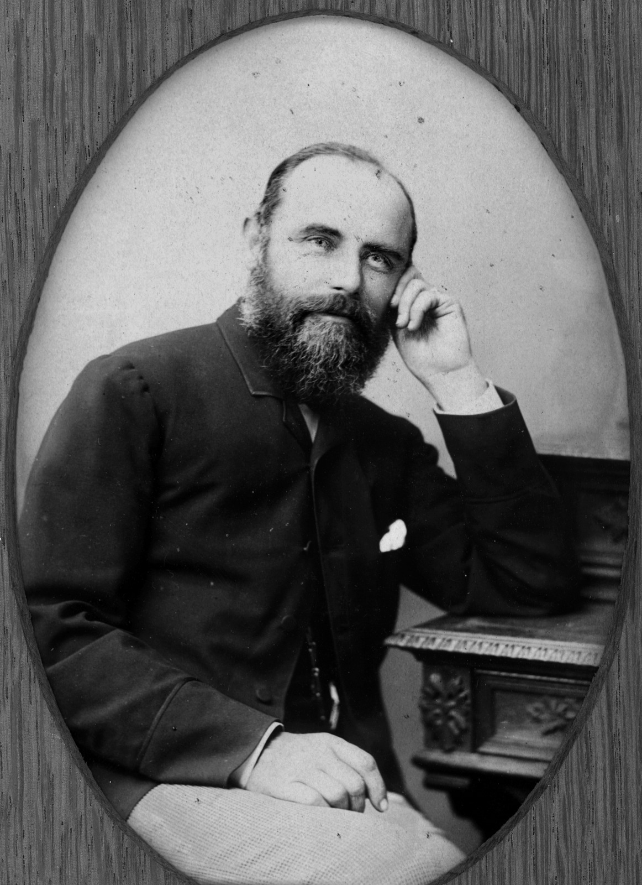

## Walter Horatio Wilson (1‑84‑22)

W. H. Wilson was a member of the Queensland Legislative Council, Minister of Justice, Secretary of Public Instruction, and Postmaster‑General in a varied political career. He was a founding member of the Anglican Church in Toowong in 1866 and found time to be elected to the Toowong Shire Council in 1884. He was also a Companion of the Order of St Michael and St George. He died at his Toowong home, *Sherwood Grove*, in February 1902, aged 62. 

<figure markdown>
  { width=40% class="full-width" }
  <figcaption markdown>[Honourable Walter Horatio Wilson 1887](https://onesearch.slq.qld.gov.au/permalink/61SLQ_INST/dls06p/alma99183505887202061) — State Library of Queensland.</figcaption>
</figure>