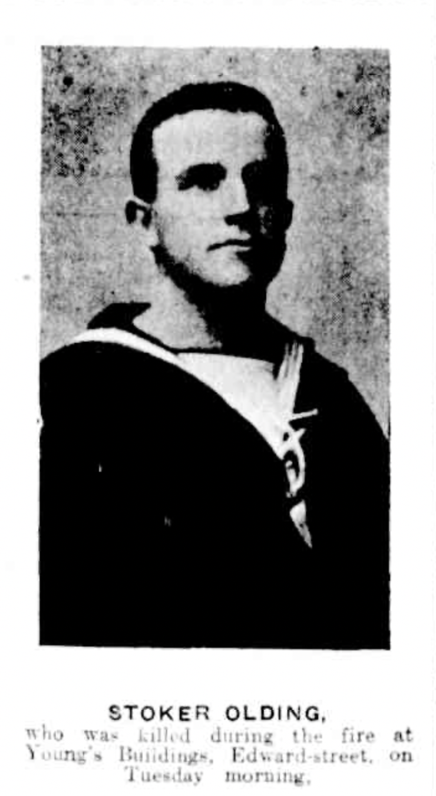

## Walter Thorpe Olding <small>[(5‑42‑7)](https://brisbane.discovereverafter.com/profile/31976177 "Go to Memorial Information" )</small>

Walter Thorpe Olding was born in Queensland on 25 September 1888. When fire broke out in a city building on 30 April 1912 he was one of a party of sailors from the HMAS *Gayundah* who came to assist. [Walter was killed by falling masonry](https://trove.nla.gov.au/newspaper/article/175235017) from the burning building. He was accorded a Naval funeral. The officers and men of the *Gayundah* erected a memorial over his grave.

{ width=33% class="full-width" }
*<small>[Walter Thorpe Olding](https://trove.nla.gov.au/newspaper/page/1573833).</small>*
