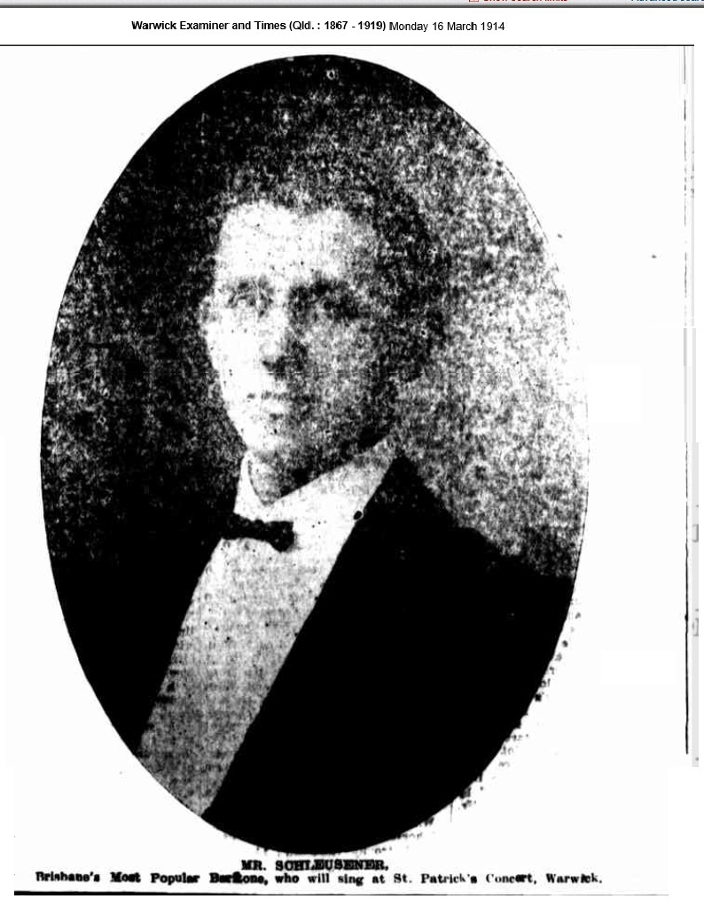

## William Ernest Schleusener <small>(18‑192‑2)</small>

<!-- 1881 - November 1924 -->

William Ernest Schleusener was born in Brisbane in 1881. His musical education began in earnest at the age of eleven, when he joined a church choir as an alto. In 1897 he became a member of the Queensland Railway Orchestra, playing the flute and piccolo. Always eager to learn more, William then took lessons on the contra bass. He became the contra bassist for Brisbane's three principal orchestras of the time. In 1906 William was appointed solo bass singer of the Albert Street Church choir and was elected Deputy Conductor.

William had the honour of singing before royalty, the Duke and Duchess of York, at Government House in 1904.

In November the same year, William took a quartet to Toowoomba, where they won first prize in a competition. This was the first of many competition wins. He even received a perfect score of 100 from one adjudicator. 

At Easter 1909, William travelled to Sydney where he won the Grand Champion Baritone Solo at the Commonwealth Eisteddfod. He received a citation from the Queensland Railway Commissioner's Office to commemorate this feat. Up to this point, William had never been defeated in any solo vocal competition.

William died at the age of 43 and was buried at Toowong Cemetery on the 29^th^ of November 1924.

{ width="40%" }  

### Acknowledgement

This story was contributed by Bill Schleusener.
