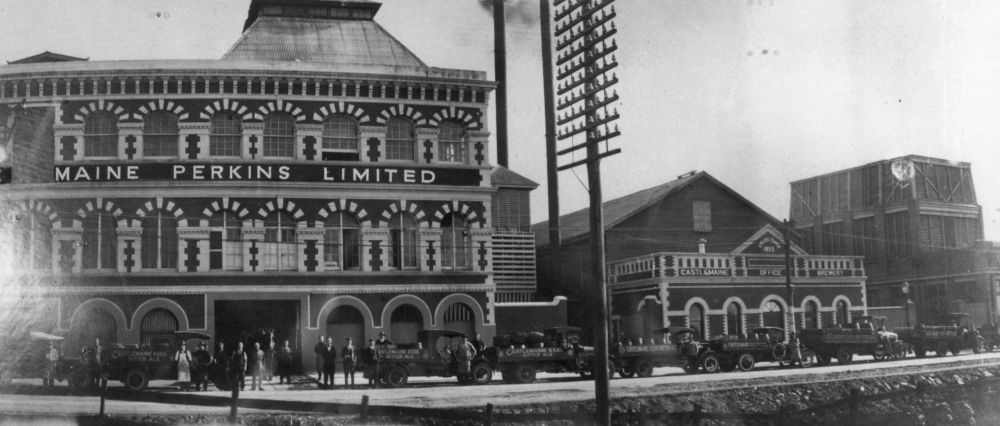

## William Grene Power <small>(7‑45‑18)</small> 

Born 1835 at Clonmel, Tipperary the son of Edward Power and Mary Ann Grene, Power was educated at Carlow by the Christian Brothers. Power arrived in Victoria in 1857 and was a miner and brewer on the goldfields at Bendigo and Ballarat. He served as Mayor of Jamiestown in 1866. 

He arrived in Queensland 1869 at the request of his old friends Perkins and Gooley to manage Browns Brewery (Perkins & Co.) and married Perkins’s sister Mary Therese and settled in Brisbane 1873. William was a Member of the Legislative Council from 1883 until his death. He died at Nundah 14 August 1903 and was buried the next day at Toowong by Rev Fr. Byrne.

{ width="70%" }  

*<small>[City Brewery, owned by Perkins & Co., Brisbane, 1872-1882](http://onesearch.slq.qld.gov.au/permalink/f/1upgmng/slq_alma21220040770002061) — State Library of Queensland.</small>*

{ width="70%" }  

*<small>[View of the Castlemaine Perkins Brewery in Milton, ca. 1929](http://onesearch.slq.qld.gov.au/permalink/f/1upgmng/slq_alma21218338590002061). The brewery, located in Milton Road, was established in 1878 by Fitzgerald, Quinlan and Co. and called the Castlemaine Brewery. The brewery merged with Perkins and Company in 1928. — State Library of Queensland.</small>*
