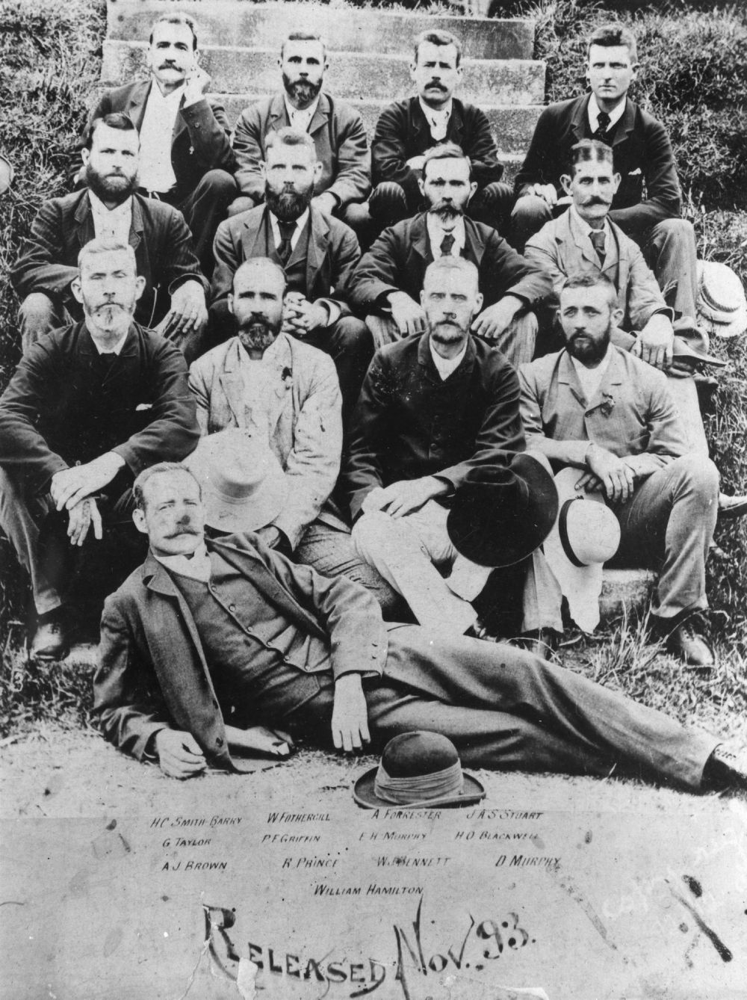

## William Hamilton <small>(9‑4‑2)</small>

William Hamilton was born in Melbourne in 1858, the son of a goldminer, George Hamilton, and his wife Mary Ann, née Richardson. By 1875 he was an itinerant bushworker in New South Wales before coming to Queensland as a shearer in 1882. He became famous as the 'ringer' of many a western shearing shed. After a stint goldmining in North Queensland and WA, he returned to shearing in 1888 in Queensland. 

He led the shearers' camp at Clermont in the 1891 shearers' strike. He was arrested with other union leaders and charged with criminal conspiracy, convicted and sentenced to three years imprisonment at St Helena. Later he entered politics as the Labour member for Gregory. At the time of [his death in 1920](https://trove.nla.gov.au/newspaper/article/177733107), he was President of the Queensland Legislative Council. 

<!-- https://trove.nla.gov.au/newspaper/article/213346121 -->

{ width="40%" }

*<small>[Unionist prisoners sentenced for causes arising out of the Shearers' Strike, 1891](http://onesearch.slq.qld.gov.au/permalink/f/1upgmng/slq_alma21220125220002061) -  State Library of Queensland</small>*   
*<small>
Back Row (Left to Right): H C Smith-Barry, W Fothergill, A Forrester, J A Stuart  
Third Row: G Taylor, P F Griffin, E H Murphy, H O BlackwelL  
Second Row: A J Brown, R Prince, W J Bennett, D Murphy  
Front: William Hamilton
</small>*
