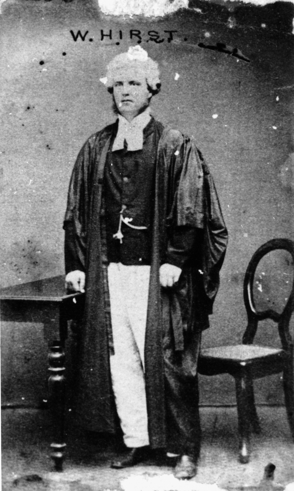

## William Henry Abbot Hirst <small>(1‑10‑17)</small>

Born Sydney on 21 February 1837 to William Hirst and Elizabeth Abbott. William Hirst was admitted as a barrister in NSW in 1861 and in Queensland the same year. He served as Police Magistrate, and later as Crown Prosecutor in the Northern District and Metropolitan District Courts before his appointment as a District Court Judge in 1869 serving the Northern District Court, based in Bowen until he replaced Ratcliffe Pring in the Central District Court in 1876. He was dismissed from office on 3 January 1878 because of misconduct and died on 26 May that year.

<figure markdown>
  { width=40% class="full-width" }
  <figcaption markdown>[William Henry Abbott Hirst](https://onesearch.slq.qld.gov.au/permalink/61SLQ_INST/dls06p/alma99183506900402061) - State Library of Queensland.</figcaption>
</figure>