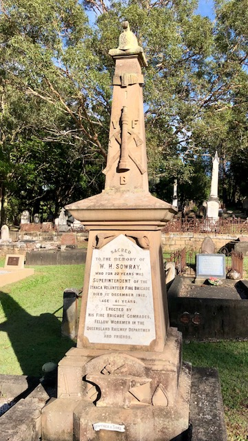

## William Henry Sowray <small>(1‑50A‑1)</small>

William Sowray was born in Staveley, in Derbyshire in England on 22 February 1851. William, a blacksmith by trade, was employed by the Railway Department and was vice-president of the Queensland Railway Union. He was also a member of the Ithaca Volunteer Fire Brigade for 23 years and was a superintendent at that organisation. 

On 1 December 1912 William was walking along Elizabeth Street, Paddington when he collapsed and died in the street. A monument over his grave erected by his fire brigade and railway comrades and friends was publicly unveiled by Hon. A. G. C. Hawthorn, M.L.C. on Sunday, April 12, 1914.

