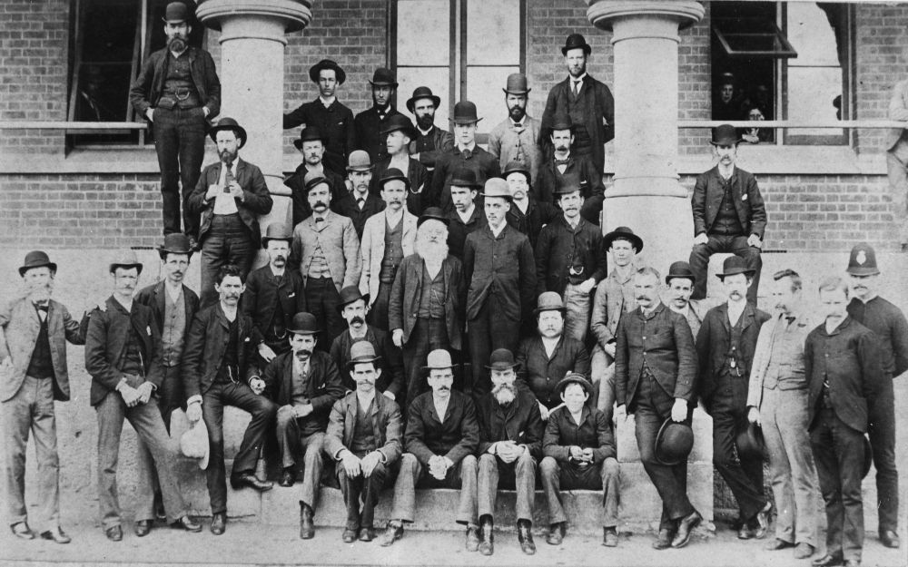
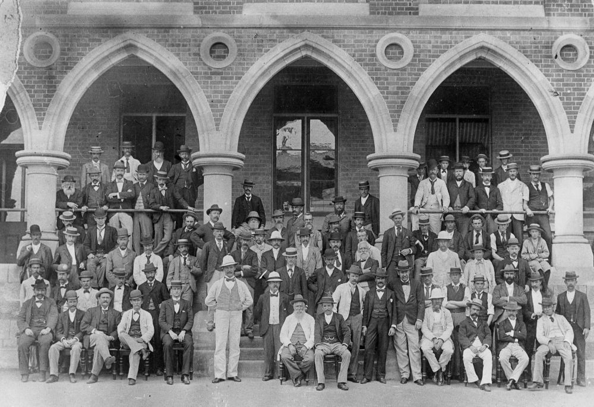

## William Henry Warman <small>(2A‑25‑27/28)</small>

William was a compositor who worked on various newspapers and at the Queensland Government Printing Office. The name 'the father of Australian compositors' was bestowed on him by the Queensland Government Printer in 1909 on his 80^th^ birthday when he was still an employee of that Office. He had left the printing trade in 1864 to take up the licence for a hotel in Petrie Terrace which he named the Caxton, after the first English printer, [William Caxton](https://en.wikipedia.org/wiki/William_Caxton). He also gave the name to the street where it was located. He returned to his old trade in 1893 and died at his home in Petrie Terrace on 31 October 1912.

{ width="48.9%" }  { width="44.5%" }

<small>[Employees on the steps of the Government Printing Office in William Street, Brisbane, ca. 1895](http://onesearch.slq.qld.gov.au/permalink/f/1upgmng/slq_alma21218936910002061) - State Library of Queensland</small>  
<small>[Staff gathered outside the Government Printing Office in Brisbane, ca. 1900](http://onesearch.slq.qld.gov.au/permalink/f/1oppkg1/slq_alma21218936760002061) - State Library of Queensland</small> 
