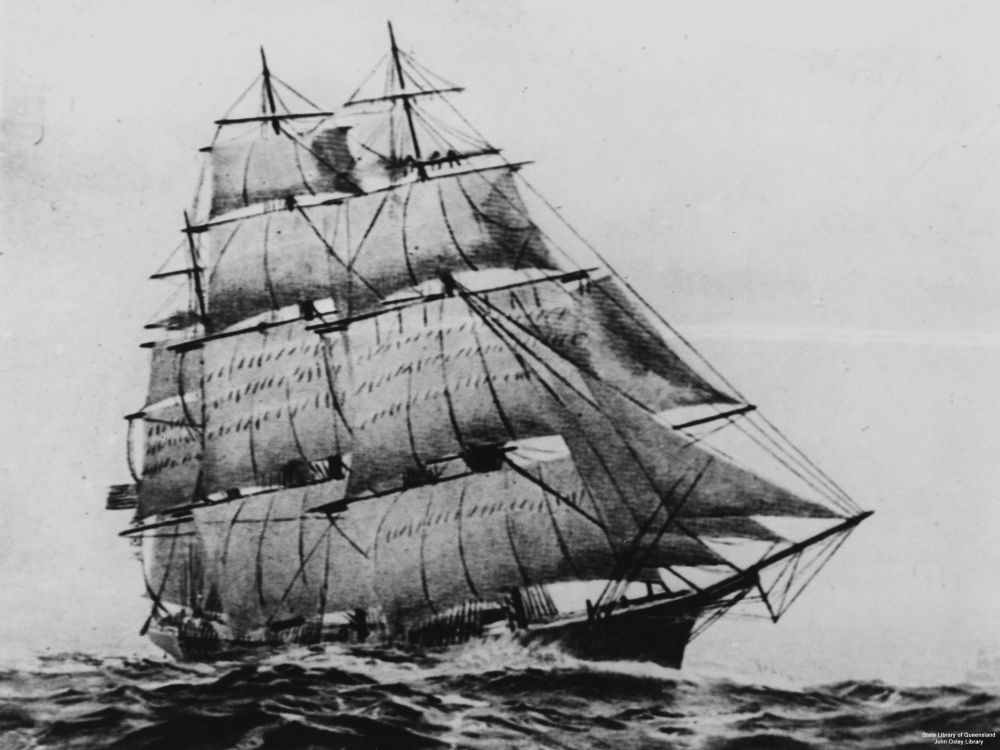
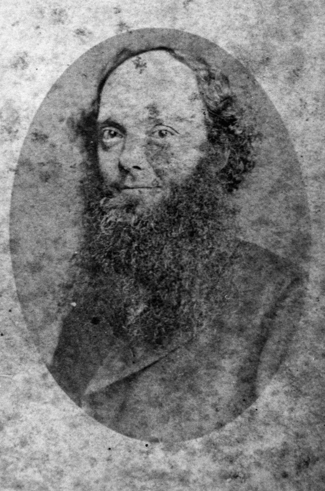

## William James Sluce <small>(2‑6‑21)</small>

A son of William Sluce and Mary Ann (née French), William James Sluce was born on 25 March 1832, in Bethnal Green, Middlesex.
Susannah Cox married William in Hackney, London between July and September 1854. 

William sailed to Brisbane aboard the *Flying Cloud* in 1862 with his wife and two children. They returned to Brisbane aboard the *Golden City* on 3 January 1865.

William, an engineer by trade, was a watchmaker, jeweller and gun maker in Brisbane. In 1868, WJ Sluce & Co advertised locations near the Town Hall 66-76 Queen Street, opposite Harris' Terrace, 68 George Street, Brisbane plus 21 Bethnal Green Road and 14 Leyton Road, Stratford, London. In 1874 William opened the Brisbane Rifle Shooting Gallery on Queen Street, next to his business.

William drowned in Breakfast Creek on 1 February 1879.

{ width="60%" }  { width="29.75%" }  

*<small>[Flying Cloud (ship)](http://onesearch.slq.qld.gov.au/permalink/f/1upgmng/slq_alma21220145060002061). Holds the world's record for passages from New York to San Francisco, and made many fast passages from Britain to Moreton Bay with immigrants. — State Library of Queensland.</small>*  
*<small>[William James Sluce, 1876](http://onesearch.slq.qld.gov.au/permalink/f/1upgmng/slq_alma21220151590002061) — State Library of Queensland.</small>*
