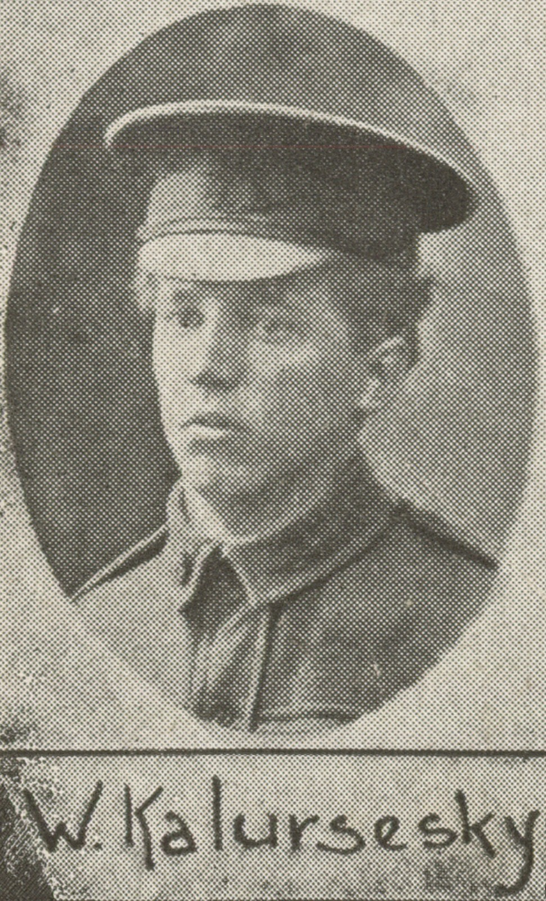

## William Kalinovsky <small>[(10‑70A‑21)](https://brisbane.discovereverafter.com/profile/31973034 "Go to Memorial Information" )</small>

Born in Russia, and a tailor by trade, he enlisted in the AIF September 1916 at the age of 23 and was in the 4^th^ pioneers as a private and was transferred to the 12th battalion and fought in France. He was promoted to Lance Corporal in Dec 1918. He was later transferred to the 1st machine gun section. 

William was classified as ‘no disability’ when assessed in 1920 upon return. He married and had a child as ==I found a great granddaughter on Ancestry who had visited his unmarked grave a long time ago with her father and she is thrilled that I am trying to get it marked.== 

From articles on Trove, it appeared that his business as a tailor went into financial difficulties and his wife left him taking the child. His medical file at National Australian Archives at Cannon Hill said his cause of death was hypertension and cardiac failure. Not long before he died, he started placing adverts in the newspaper to try to get more business. 

{ width="40%" class="full-width" } 

*<small>[W. Kalursesky, one of the soldiers photographed in The Queenslander Pictorial, supplement to The Queenslander, 1917.](https://onesearch.slq.qld.gov.au/permalink/61SLQ_INST/1dejkfd/alma99183929113602061).</small>*

<!-- https://russiananzacs.net/Kalinovsky -->
