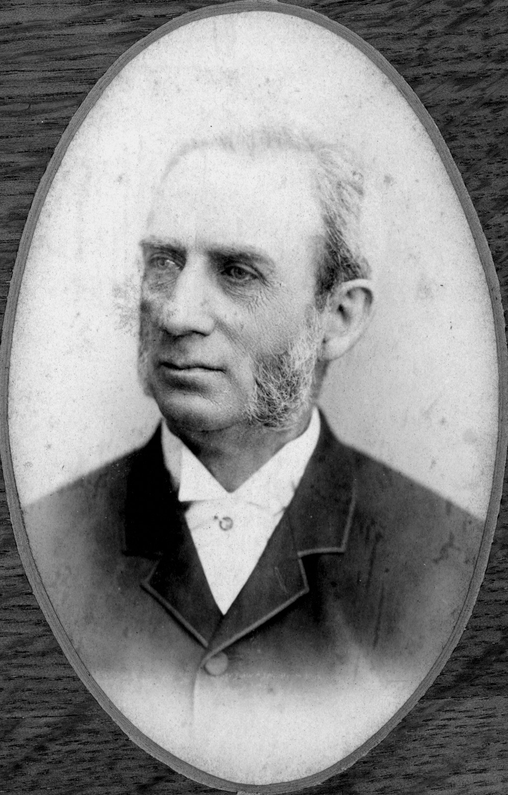

## Fleet Paymaster: William Leworthy Goode Drew CMG <small>[(13‑86‑1)](https://brisbane.discovereverafter.com/profile/31773873 "Go to Memorial Information" )</small>

William was born to Captain George Drew RN and Caroline Fulford née Goode 14 October 1826 in Broadstairs, Kent, England. His father had served in the Napoleonic Wars.

<figure markdown>
  { width="30%" class="full-width" }
  <figcaption markdown>[William Leworthy Goode Drew, C.M.G.](https://onesearch.slq.qld.gov.au/permalink/61SLQ_INST/1dejkfd/alma99183505521602061), 1889 — State Library of Queensland.</figcaption>
</figure>

<!--
Under Secretary Treasury appointed 8 February 1862; Commissioner for Stamp Duties, appointed 29 July 1883, Chairman Immigration Board appointed 29 July 1883. Auditor General, appointed 1 October 1877; Chairman Civil Service Board, appointed 4 December 1889; Chairman State Service & Investment Board, appointed 4 December 1899,(Information taken from Queensland Blue Books 1869 and 1889)
-->