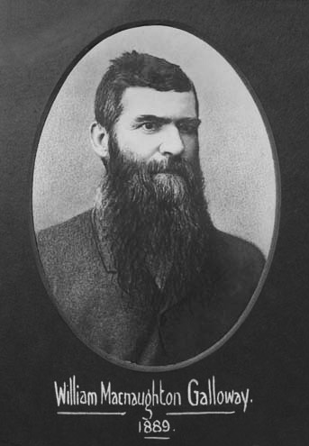

## William MacNaughton Galloway <small>(7A‑41‑18)</small>

Former Mayor of Brisbane, William Galloway commenced building the Breakfast Creek Hotel in 1889. His initials appear on the front façade. It opened its doors in May 1890 and was an immediate success. Galloway remained with the hotel until his death on the 12^th^ of January 1895, after a fall from a second floor window of the hotel (the coroner found that he was drunk at the time of his death). He was born in the city of Perth, Scotland on the 16^th^ of May 1840. 

He was an Alderman in the Brisbane Municipal Council from 1884 to 1891, serving one term as Mayor in 1889. He served on a number of committees, namely the:

- Finance Committee 1884, 1886, 1890
- Works Committee 1885, 1887, 1889, 1891
- Legislative Committee 1885, 1889
- Town Hall Committee 1885—1887
- Health Committee 1887, 1889—1891 
- Street Lighting Committee 1891

He married Anne Hunter in Sydney in 1885 before moving to Aberleigh, Kelvin Grove where they lived until settling into his newly completed hotel.

{ width="28%" }  { width="60.8%" }  

*<small>[Lord Mayor William Macnaughton Galloway](https://library-brisbane.ent.sirsidynix.net.au/client/en_AU/BrisbaneImages/search/detailnonmodal/ent:$002f$002fSD_ASSET$002f0$002fSD_ASSET:19488/one?qu=Lord+Mayor+William+Macnaughton+Galloway&rm=BRISBANEIMAGES0%7C%7C%7C1%7C%7C%7C0%7C%7C%7Ctrue&te=ASSET&lm=ALL_ASSETS), 1889 — Brisbane City Council.</small>*  
*<small>[Flood waters at the Breakfast Creek Hotel, Brisbane, 1893](http://onesearch.slq.qld.gov.au/permalink/f/1upgmng/slq_alma21218154110002061) — State Library of Queensland.</small>*
