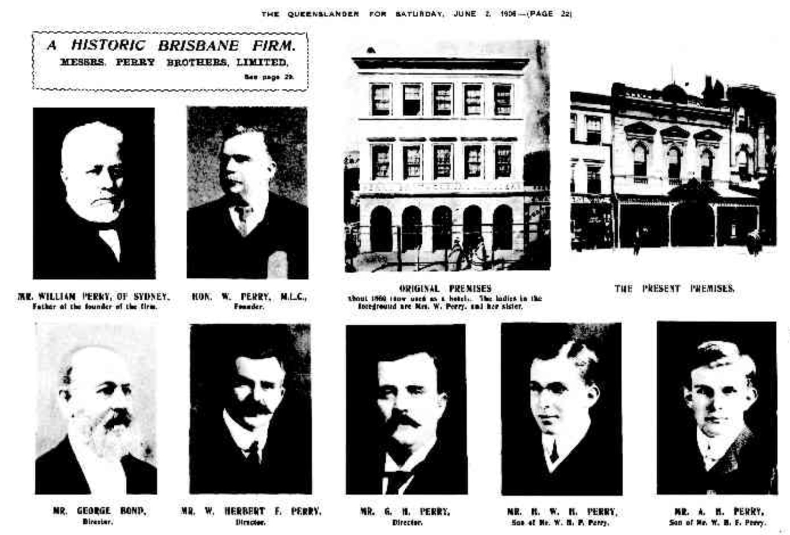
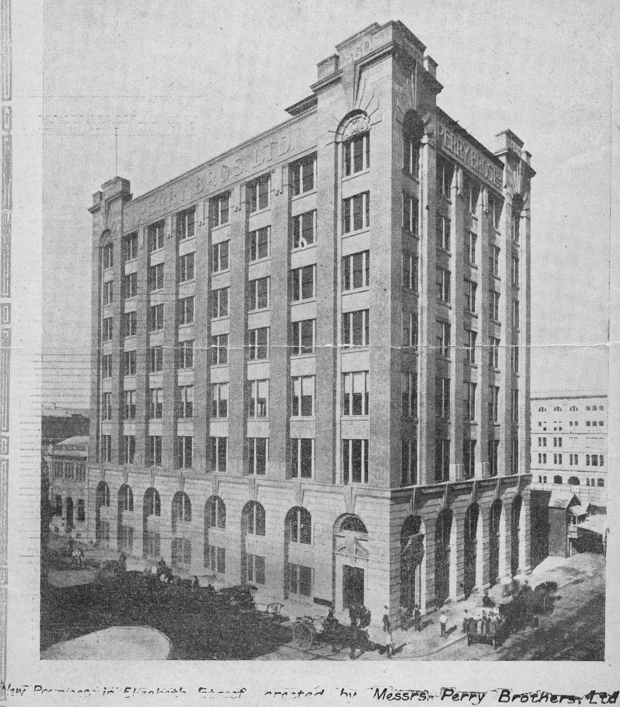

## William Perry <small>[(13‑70‑1)](https://brisbane.discovereverafter.com/profile/32023147 "Go to Memorial Information" )</small>

William Perry was one of Brisbane's earliest businessmen. He arrived in Brisbane in June 1860 and had set up a hardware store in Queen St by August of that year. He was joined in business by his brothers George and Frederick. The business thrived, and further flourished under William's sons, Herbert and George. 

<figure markdown>
  { width="70%" }
  <figcaption markdown>[Perry Brothers Limited](https://trove.nla.gov.au/newspaper/page/2462839) -  The Queenslander, 2 June 1906</figcaption>
</figure>

During 1911 to 1913, Herbert and George highlighted their business by building Brisbane's then tallest building, the eight storey Perry House on the corner of Elizabeth and Albert Streets in the city.

<figure markdown>
  { width="40%" }
  <figcaption markdown>[Perry Brothers premises in Elizabeth Street, Brisbane, Queensland, 1913](https://onesearch.slq.qld.gov.au/permalink/61SLQ_INST/dls06p/alma99184004961202061) — State Library of Queensland</figcaption>
</figure>

William entered Queensland politics, becoming a member of the Queensland Legislative Council on 22 September 1890. [He died from heart failure](https://trove.nla.gov.au/newspaper/article/146871483) at his home, *Folkestone*, Breakfast Creek Road, on 11 June 1891. A large concourse, including many politicians, attended the [funeral at Toowong Cemetery](https://trove.nla.gov.au/newspaper/article/172683331) the next day.
