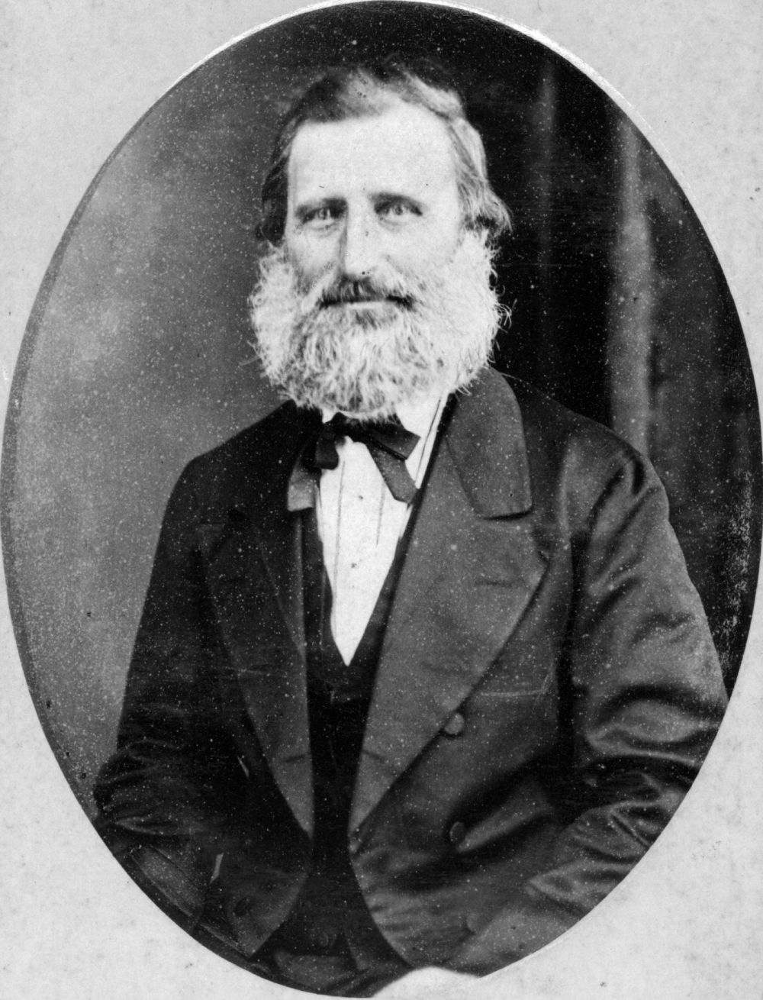

## William Pettigrew <small>(13‑66‑2)</small>

[William Pettigrew](https://adb.anu.edu.au/biography/pettigrew-william-13152) born on 26 August 1825 was the son of an Ayreshire farmer. He trained as a surveyor and as such arrived aboard the Fortitude in January 1849. He became a sawmiller, importing the first steam‑powered sawmill in 1853. Pettigrew was elected to the Brisbane Municipal Council three times in the period 1863 – 1881, including the mayoralty in 1870–1871. There is an overlap between his municipal duties and membership of the Queensland Legislative Council from 1877–1894. 

He was a member of a number of societies; including the Queensland Philosophical Society, the School of Arts Committee (along with Samuel Walker Griffith) and was a life‑member of the Queensland Acclimatisation Society. He was also a land speculator. 

His wife Amelia Boughay, a fellow Fortitude passenger whom he had married in 18 February 1859, pre‑deceased him on 1 September 1893 and is buried here. He died on 28 October 1906 and was interred in at Bowen. William Pettigrew was a strict Presbyterian, who kept the Sabbath sacred to the extent of walking to church and banning musical instruments from worship.

{ width="49%" }  { width="43%" }  

*<small>[William Pettigrew, Brisbane, ca. 1875](http://onesearch.slq.qld.gov.au/permalink/f/1upgmng/slq_alma21218159620002061) — State Library of Queensland.</small>*  
*<small>[Wife of William Pettigrew, Brisbane](http://onesearch.slq.qld.gov.au/permalink/f/1upgmng/slq_alma21218213630002061), Amelia Boughay, (1824-1893) born London, died Brisbane. — State Library of Queensland.</small>*
