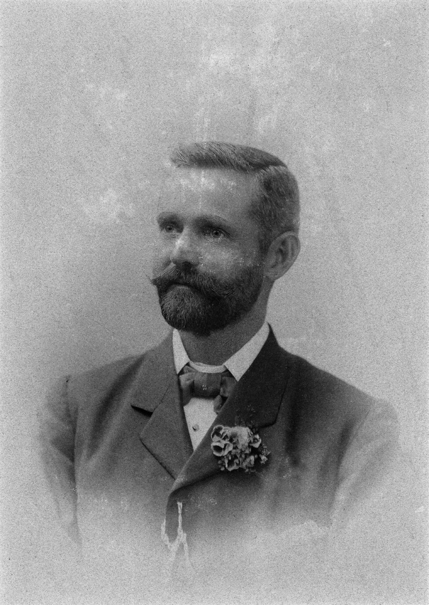
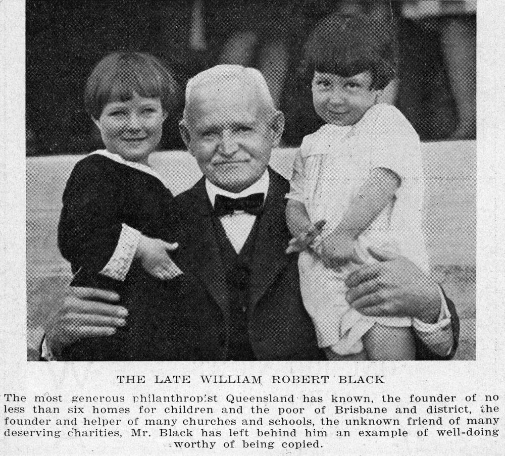

## William Robert Black <small>(8‑43‑33/34)</small> 

<!-- 1859‑1930 -->

Born in Northern Ireland in 1859, [William Robert Black](https://adb.anu.edu.au/biography/black-william-robert-5254/text8853) reportedly arrived in Australia as a refugee as a result of potato famine. Moving to Brisbane, he made his living delivering coal to houses by handcart and later, horse and cart. Black continued to expand his work until he owned a fleet of six launches and 20 lighter, delivering coal using the Brisbane and Bremer River systems. During this time and as a result of his success, he also purchased 700 acres of coal deposits at Bundamba in Ipswich, where he established the Blackheath Colliery, complete with electric haulage and advanced machinery where he broke all state records in the cutting and haulage of coal. Other collieries soon followed at Walloon and another in the centre of Ipswich. 

After his retirement 1920, Black sought to share his wealth, contributing through a number of philanthropic ventures including the establishment of Fairholme College in Toowoomba, Scots College in Warwick, Brisbane Boys’ College Council, Somerville House Council, and founding Emmanuel College at the University of Queensland, St Lucia. As a particularly religious man, he saw his contribution to these religious schools as ensuring the link between religion and education. This continued until his death in 1930 when his estate was left in trust for the Presbyterian Church in Queensland. William Black never married.  

{ width="35.2%" } { width="55%" } 

*<small>[William Robert Black, ca. 1898](http://onesearch.slq.qld.gov.au/permalink/f/1upgmng/slq_alma21218186840002061) - State Library of Queensland. </small>*  
*<small>[William Robert Black](http://onesearch.slq.qld.gov.au/permalink/f/1upgmng/slq_digitool195043), ca. 1931 - State Library of Queensland. </small>*
