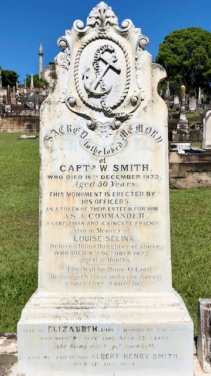

## Captain William Smith <small>(13‑6‑21)</small>

William Smith and his ten‑month old daughter died within two months of each other in 1872 and were interred at the Paddington Cemetery. Their remains and headstone were relocated to Toowong Cemetery in June 1881. Since then, another four family members have been buried in the grave.

{ width="30%" }   
