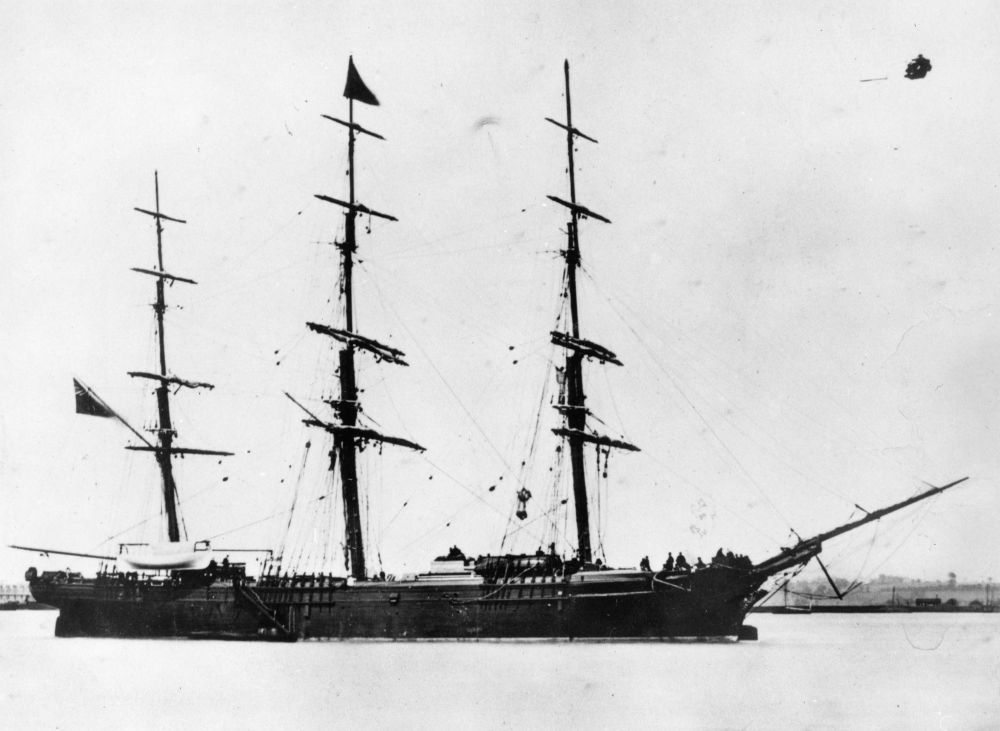

## William Thomas Birkbeck <small>(9‑16‑8/9)</small>

William was born in St Pancras, Middlesex to George Henry Birkbeck, mechanical engineer, and Elizabeth (née Christmas) on 30 January 1848. William sailed to Brisbane aboard the *Young Australia*, arriving on 13 July 1869. Kate Jackson married William in Brisbane on 2 March 1876. 

William was involved in the Gympie and Palmer River gold rushes and the timber trade around Noosa.

William was the publican of the Commercial Hotel, Tewantin for approximately four years until mid 1885. The 19 September 1892 supplementary electoral roll listed William as a bookkeeper residing in *San Jacinto*, Quay Street, Brisbane, aged 44 years. William held the publican's licence for Lennons for three months in 1903 before applying for that licence again in April 1905, when he and his wife and ten children resided at "*Bankside*" North Quay, Brisbane. He proposed to transfer the licence in 1 July 1905, but was still in charge on 3 September 1905.

In June 1907, now with 11 children. William applied to transfer the licence for the Queensland Club Hotel, Mary Street, Brisbane.
On 19 March 1909 William, late of Quay Street, North Quay, died in the Friendly Societies Hospital, Wickham Terrace, Brisbane, aged 61 years leaving his widow and 11 children. 

{ width="70%" }  

*<small>[Young Australia](http://onesearch.slq.qld.gov.au/permalink/f/1upgmng/slq_alma21219330430002061) — State Library of Queensland.</small>*
