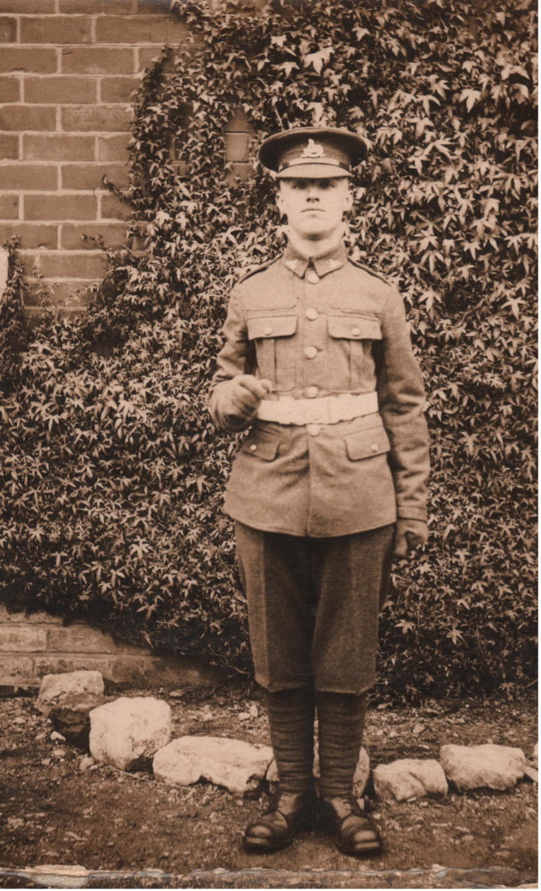
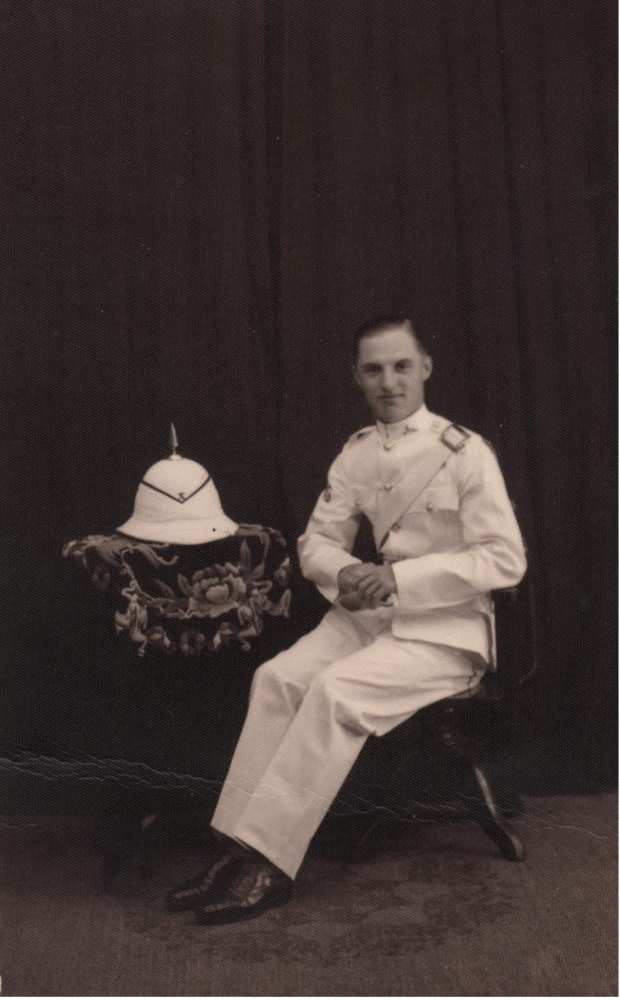

## William Walter Brown <small>(18‑25‑47B)</small>

William Walter Brown, Lance Corporal 4799109, was born on 12 November 1911 in Bilsthorpe Road, Southwell, in the County of Nottinghamshire to Walter Brown (Farm Labourer - Retired) and Kate Dowman. Bill was the eldest boy and Anne, Edward, Wilford, Mary, Victor followed. All the boys joined the Army in the Second World War.

As a young school boy, to help family finances, Bill picked turnips from farms into the dark hours of evening after school. His Father was upset to see boy working so hard. He was always a great help to his Mother. He was 17 when, seeking adventure, he joined the Lincolnshire Regiment Regular Army on 11 December 1928. 

His service overseas included:

- Gibraltar - 4 February 1930 to 13 October 1931
- Shanghai - 14 October 1931 to 2 September 1932
- Hong Kong - 30 September 1932 to 12 February 1936
- British Expeditionary Force ([BEF](https://en.wikipedia.org/wiki/British_Expeditionary_Force_(World_War_II))) - 13 November 1939 to 7 March 1940

Service details include: 

- Military Conduct: Very good
- Medals: 1939-45 Star, War medal 1939-45
- Rank: Lance Corporal
- Transferred to Section B reserve 27 February 1936
- Mobilised: 2 September 1939
- Discharged: 1 July 1940
- Cause of discharge: Ceasing to fulfil Army physical requirements due to what he went through at Dunkirk probably related to the injury to his head.

{ width="28%" }  { width="28.65%" }  

<!-- needs attribution -->

According to his widow, he had a wonderful life in the army. Bill was in the Army Military Brass band, very musical, and played the Clarinet. 

Bill spoke a bit about the good times in Kowloon. In those days the army band played and were the entertainers at the races, etc. Consequently, for bandsmen, social life in the army left nothing to be desired. He was in the hockey team in India and had a great life in both India and Spain. Bill was a keen sportsman.

Bill said when he was in the BEF in France when the Germans by-passed the [Maginot Line](https://en.wikipedia.org/wiki/Maginot_Line) into France and took Belgium, and the BEF retreated. They had to run for their lives on foot as the German tanks were after them. They jumped on anything available to get to Dunkirk. He waded out to a small boat which took him to a cruiser which took him back to England. He suffered an injury to his head. When he came to Australia after a few years he had a mastoidectemy operation to the area and the specialist said he was not to play clarinet or any other wind instrument again.

When he ventured to Australia the Government allowed Poms to migrate for 10 pound single. He preferred to pay his own fare. He had heard what a great country Australia was - the ideal climate and good work opportunities appealed. Still single, Bill liked travel and adventure and he was prepared to start a new life the other side of the world.

He made friends with others on board ship and together they worked in the Forestry Dept. on arrival. Later he nursed at the Jubilee hospital Dalby and met his future wife Olive, a sister while there. He enjoyed his time at Dalby. When he left Dalby he was employed by Palings in the Band Instrument Dept. in Queen St, Brisbane. He was very familiar with brass band instruments and was transferred, as Manager, to Grice Nicholsens, in George St. Brisbane. After they closed he went back as a salesman to Queen St. in the Band Inst. Dept. to what became Music Houses of Aust. Ltd. 

He was always very conscientious, generous to a fault, unassuming and gave of his best. Bill was very loyal to his wife and friends. He had his own special clients who would take to him their various instruments for repair and ask especially for him only to care for their needs. He travelled to various band performances over Queensland and exhibitions for sales. The Brisbane Exhibition always annually. He was offered the position of Manager of the Band instrument dept. in Sydney but refused as he preferred the Queensland people, the climate and the hospitality.

He joined the Brisbane Municipal Band in Brisbane and was well liked by the members especially Abby Jackson the Band Master who picked him up every Saturday to play at races, City Hall, and elsewhere. Unfortunately he had to resign or retire after his mastoidectomy operation.

Bill now 41 years, married Olive on 10 July 1953 at the Auchenflower Presbyterian Church in Weinholt St. officiated by the Rev. Eric McKay. They lived at Archerfield for 3 years and then bought 91 Munro St. Auchenflower. After Olive's parents passed away they moved to Birdwood Terrace Auchenflower where her parents had lived since their marriage. Bill also joined the Toowong R.S.L when he came to Auchenflower.

Bill retired at the age of 69 years on the 8 April 1980. After marriage he exhibited and bred German Shepherds for a number of years and was very successful in the show ring up and down the East Australian coast. Following this he joined Auchenflower Bowls Club and was fascinated with the game while enjoying the company of other bowlers and was in their pennant teams. At home he kept fowls, had a large vegetable patch and was always very active both in and outside the home.

Unfortunately Bill suffered ill health from angina and cardiac heart problems in later years. He never complained or allowed this to prevent him from helping others. He was a resident of Queensland for 58 years.

He passed away in the Royal Brisbane hospital 31 January 2004, aged 92 years. His funeral was held at Alex Gow Funeral Parlour the Rev. H.T. Seaton officiating. The Last Post was played and his coffin covered by the British Flag. The RSL President was present at his funeral and a wreath laid. RIP
