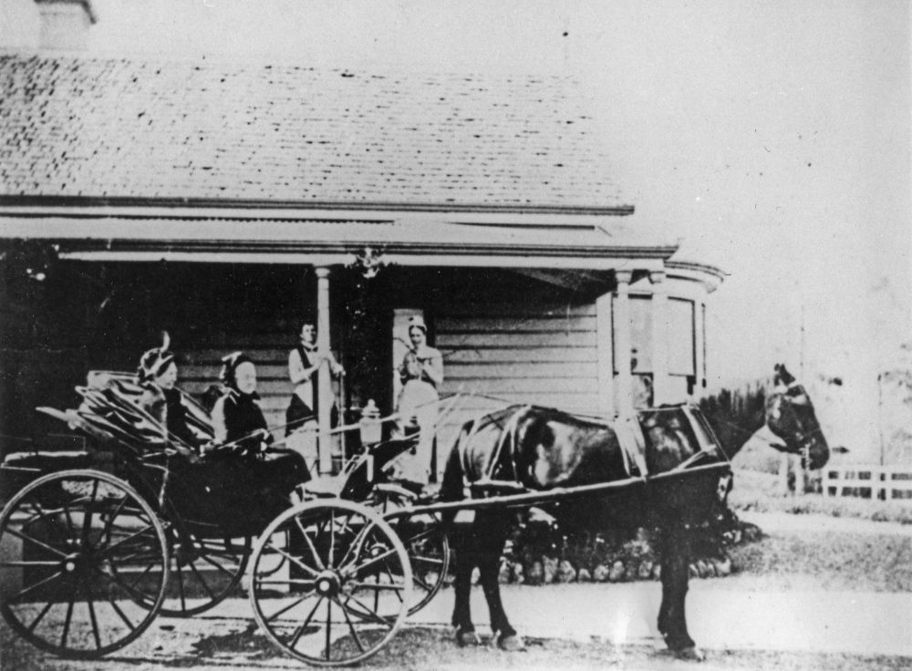

## William Webster <small>[(1‑37-6)](https://brisbane.discovereverafter.com/profile/31970828 "Go to Memorial Information" )</small>

A Scottish merchant, William died at his home *Arley*, Toowong, aged 66 in 1895. William purchased *Arley*, opposite the railway station after its previous owner, bank manager Alexander Archer, drowned in the *Quetta* shipwreck in 1890.

{ width="70%" }

*<small>[Horse and carriage outside the Archer family residence, Arley, Toowong, ca. 1882](http://onesearch.slq.qld.gov.au/permalink/f/1upgmng/slq_alma21220551310002061) — State Library of Queensland </small>*
